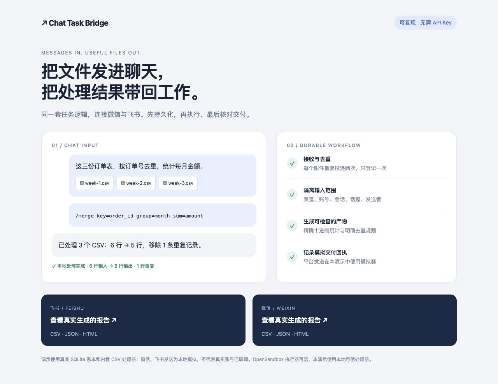

# Chat Task Bridge

**把文件发进微信或飞书，让 Python 处理器完成任务，再把结果送回原会话。**

一个独立的 Python 项目：渠道适配器、持久化任务账本、可替换执行器。首个功能是 CSV 合并、去重和金额统计，无需大模型或模型 API Key。微信／飞书平台凭证由部署者保管。

> **预览版。** 已验证本地完整流程、离线平台协议模拟和真实 SDK 模型兼容性。真实微信账号、飞书应用及 OpenSandbox 服务器尚未联调；不要把模拟测试当作真实平台验收。



## 从输入到输出

1. 在私聊里发送多份 UTF-8 CSV，每份收到暂存确认。
2. 输入 `/merge key=order_id group=month sum=amount`。
3. 收到 `merged.csv`、`summary.json` 和 `report.html`。

普通 `/merge` 按整行去重；`key=列名` 按键去重，同键内容冲突会失败，不任意保留其中一行。`group` 和 `sum` 必须成对使用，金额采用十进制计算。表头可以换序，但必须包含相同的列。

每个渠道账户、会话、话题和发送者有独立的附件集合。同群不同成员的文件不会自动混合。`/status` 查询近期任务；`/discard` 清空自己的待处理文件。

**支持范围：** CSV；微信个人私聊的文本／文件；飞书文本／文件输入和原消息回复。暂不支持 XLSX、任意自然语言指令、微信图片／语音处理或微信群。发送文件中的代码不会被执行。

## 两分钟运行无凭证演示

Python 3.11+，Linux 或 macOS（Windows 可使用 WSL）。

```bash
git clone https://github.com/crown-sports/chat-task-bridge.git
cd chat-task-bridge
python3 -m venv .venv
source .venv/bin/activate
python -m pip install -e .
chatbridge demo --output demo-output
```

打开生成的 `demo-output/index.html`。演示对每个附件提交两次，实际只处理一次；两个模拟渠道分别生成 **6 行输入 → 5 行输出、移除 1 行重复** 的文件，月度合计为 **200.50、360**。处理器和 SQLite 账本真实运行，平台交付被明确标为模拟。

## 接飞书

```bash
python -m pip install -e '.[feishu]'
cp .env.example .env
chmod 600 .env
# 在自己的编辑器里填入配置，不要提交 .env。
set -a
source .env
set +a
chatbridge run feishu --state .chatbridge/feishu
```

必须配置 `FEISHU_APP_ID`、`FEISHU_APP_SECRET`、`CHATBRIDGE_ALLOWED_SENDERS`（发送者 open_id，逗号分隔）。没有发送者白名单不会启动。配置飞书自建应用的机器人能力、消息事件与权限后，使用官方 SDK 长连接接收事件，无需自行开放公网回调端口。

详见 [飞书接入与确认语义](docs/feishu.md)。事件只有在持久化提交后才确认 SDK 回调；平台实际重投范围仍需真实联调验证。

## 接个人微信

```bash
chatbridge login weixin --state .chatbridge/weixin
# 在终端扫码；令牌只写入本机私有状态文件。
export CHATBRIDGE_ALLOWED_SENDERS='your_authorized_sender_id'
chatbridge run weixin --state .chatbridge/weixin
```

发送者 ID 可从自己的登录信息中读取，不要分享完整凭证文件。登录、地区与账户权限以官方平台实际能力为准。详见 [微信接入和已知边界](docs/weixin.md)。图片、语音、视频会收到不支持提示，不阻塞后续文件任务。

这两个 `run` 命令使用不同状态目录，可分别运行。每个目录只允许一个工作器；v0.1 没有分布式调度或多副本能力。

## 可选 OpenSandbox 执行

本地执行器只调用随包提供的可信 CSV 函数。需要把任务放进独立容器时：

```bash
python -m pip install -e '.[sandbox]'
# 在 .env 配置 OPENSANDBOX_DOMAIN、OPENSANDBOX_API_KEY 等变量后加载。
chatbridge run feishu --executor opensandbox --state .chatbridge/feishu
```

每个任务创建独立沙箱，禁止默认网络出口，上传固定处理器和输入文件。只有明确完成且退出码为 0 才接收产物，结束时销毁；实例另有服务端存活期限。API Key 不写入沙箱脚本、输入文件或日志。[配置与限制](docs/opensandbox.md)

## 失败之后会怎样

```text
消息 ──持久化──▶ queued ──▶ running ──产物持久化──▶ ready
                              │                     │
                       重启/完成不明                发送
                              ▼                     ▼
                       unknown_execution         delivering
                                             ┌──────┼───────┐
                                         delivered 失败   结果不明
                                                 │         │
                                          delivery_failed unknown_delivery
```

- 重复入站事件复用同一任务 ID。清理旧任务后仍保留轻量去重记录。
- 已保存的产物可以在重启后继续交付，无需重新执行。
- 执行中断或交付结果不明时停止自动重试，避免重复副作用。
- 多文件交付部分成功后超时，也记为未知。不能承诺端到端 exactly-once。
- `delivered` 表示平台确认接受，或演示适配器确认模拟接受；不表示收件人已阅读。

```bash
chatbridge jobs --state .chatbridge/feishu
# 停止对应工作器后，重试明确失败的交付，再重新启动工作器：
chatbridge retry-delivery JOB_ID --state .chatbridge/feishu
# 若上次结果不明，显式承担重复发送风险：
chatbridge retry-delivery JOB_ID --allow-unknown --state .chatbridge/feishu
# 清理默认仅预览；--apply 才删除。未知任务始终保留。
chatbridge gc --state .chatbridge/feishu --days 7
chatbridge gc --state .chatbridge/feishu --days 7 --apply
```

单文件上限 8 MiB，每批最多 20 个／32 MiB；处理器另限制 50,000 行和 1,000,000 个单元格。输出每个文件也限制 8 MiB。没有总磁盘硬配额，部署者需要定期清理和监测磁盘。

## 代码组织

```text
src/chatbridge/
  model.py        消息、附件、结果、回执和接口
  ledger.py       SQLite 入站去重、暂存、任务与交付账本
  storage.py      私有文件、内容哈希和完整性校验
  service.py      执行与交付用例、恢复边界
  channels/       飞书／微信协议适配器
  executor.py     本地与 OpenSandbox 执行策略
  table_task.py   无第三方依赖的确定性 CSV 处理器
  cli.py          登录、启动、查询和清理
  demo.py         无凭证可复现演示
```

设计采用端口与适配器、执行策略和持久化账本三个边界，没有移入原应用的运行时、业务模块或配置。方法说明围绕确认时机、输入边界和失败语义重新编写。

扩展处理器只需实现 `Executor.run(job_id, message) -> TaskResult`；替换渠道实现 `Channel`。添加处理器时也要明确重试语义；不要将任意用户代码接到本地执行器。

## 验证与贡献

```bash
python -m pip install -e '.[dev,feishu,sandbox]'
pytest -q
ruff check .
ruff format --check .
python -m build
```

测试覆盖协议错误／超时、加密文件往返、游标提交顺序、附件范围、崩溃恢复、实际 SDK 模型、CSV 冲突与公式注入。详见 [验证记录](docs/validation.md)、[安全边界](SECURITY.md) 和 [来源说明](THIRD_PARTY.md)。

下一阶段是经授权的真实平台联调，再考虑多租户预算调度。当前没有宣称超越现有 Agent 框架，也没有未测量的性能提升数字。

MIT License。
