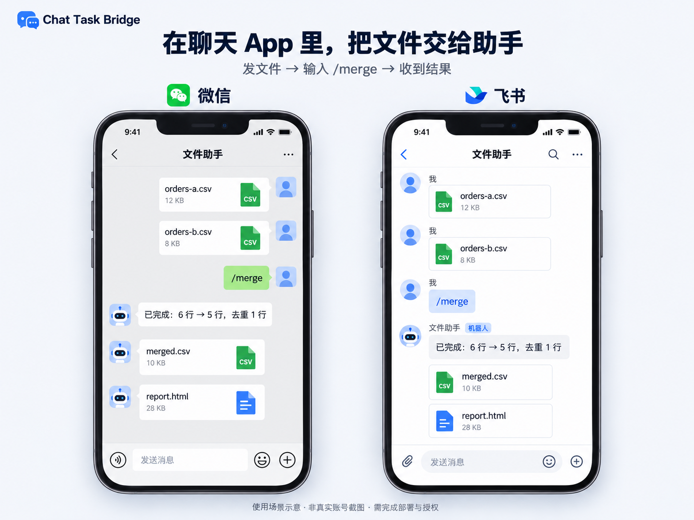

# App 使用场景示意

这张图帮助读者理解使用入口：在微信或飞书会话中发送 CSV 文件，输入 `/merge`，再在原会话收到结果文件。图中聊天、头像与文件均为虚构示例；它是原创绘制的场景示意，不是真实账号联调截图，也不表示与平台存在官方合作。

微信参考浅灰聊天底色、右侧绿色气泡、左侧白色回复和底部输入栏；飞书参考白色聊天区、发送者名称、机器人标记和附件卡片。不同客户端版本的实际布局可能不同。

参考资料（2026-10-08 查阅）：

- [微信官方 App Store 页面](https://apps.apple.com/cn/app/%E5%BE%AE%E4%BF%A1/id414478124)
- [飞书官方 App Store 页面](https://apps.apple.com/cn/app/%E9%A3%9E%E4%B9%A6-%E5%AD%97%E8%8A%82%E8%B7%B3%E5%8A%A8%E6%97%97%E4%B8%8B-ai-%E5%B7%A5%E4%BD%9C%E5%B9%B3%E5%8F%B0/id1401729613)
- [飞书帮助中心的移动聊天示例](https://www.feishu.cn/hc/en-US/articles/021999222267-v5.19-save-webpage-to-docs-by-feishu-clip)

使用内置 imagegen 工具生成。完整提示词保存于 [app-preview-prompt.txt](app-preview-prompt.txt)。图片随 Python 包分发，使安装后的 `chatbridge demo` 也能显示 App 场景。

首版仍需要部署者配置平台权限和允许的发送者；真实账号验证状态见 [验证记录](validation.md)。
